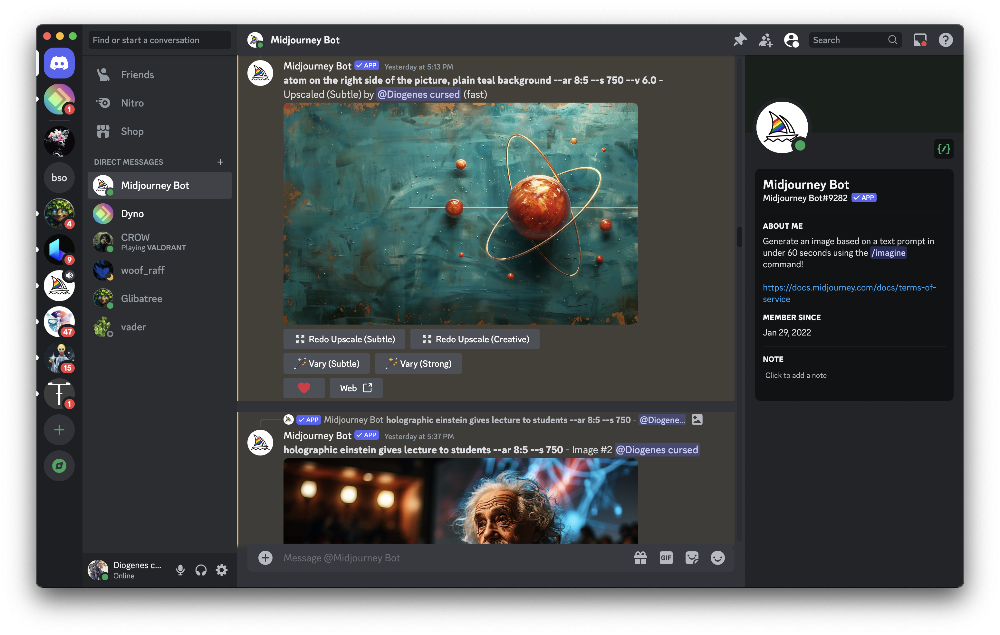
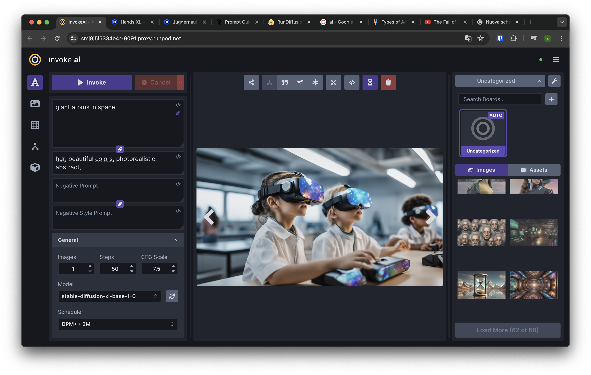

Nel nostro progetto, abbiamo voluto esplorare l'idea di usare l'IA generativa
nel contesto di musei per la scienza. La GenAI può essere una risorsa
importante in un contesto educativo, ed essendo una nuova tecnologia c'è molto
terreno di esplorazione nei suoi potenziali usi e su quali sono effettivamente
utili e responsabili, e favorevoli alla creazione di un ambiente didattico
stimolante ed efficace. 

# Fase 1 - Sviluppo dell'idea

Per lo sviluppo iniziale dell'idea, abbiamo interrogato i tre seguenti modelli:

- GPT-4o
- Anthropic Claude Opus
- Google Gemini 1.5

Abbiamo fatto esperimenti con diversi prompt, e alla fine abbiamo deciso di
optare per prompt che dessero risposte più mirate e concise, in modo da avere
idee più autocontenute e facilmente confrontabili. Abbiamo dato ai modelli il
ruolo di consulente, usando il seguente prompt:

> Immagina di essere un consulente ingaggiato da un museo della scienza per
> ideare una nuova esperienza museale immersiva. L’obiettivo è sfruttare le
> potenzialità della AI generativa per creare un’attività interattiva che
> permetta ai visitatori di apprendere in modo coinvolgente concetti
> scientifici complessi.
>
> Proponi un concept creativo e innovativo per questa esperienza, descrivendo
> come la AI generativa verrebbe utilizzata e quali sarebbero i principali
> elementi dell’attività. Fornisci dettagli su come l’esperienza si svolgerebbe,
> quali tecnologie specifiche di AI generativa sarebbero impiegate, quali
> contenuti educativi verrebbero trasmessi e in che modo, e come l’interattività
> e l’immersività sarebbero raggiunte.
>
> Nella tua risposta, cerca di essere mirato e conciso, spiegando il cuore
> dell’idea in non più di due o tre paragrafi.

## Risposte

### GPT4-O

> Il concept proposto è una "Stazione di Viaggio nel Tempo Scientifico",
> un'esperienza immersiva che utilizza l'AI generativa per trasportare i
> visitatori attraverso epoche scientifiche chiave. I visitatori indosseranno
> visori di [realtà aumentata (AR)]{.mark} e si troveranno in un ambiente
> virtuale che cambia dinamicamente in base alle loro interazioni. Utilizzando
> modelli di linguaggio AI come GPT-4, [i visitatori potranno dialogare con
> avatar di scienziati storici come Isaac Newton, Marie Curie e Albert
> Einstein, che risponderanno in modo realistico e contestualizzato, spiegando
> concetti scientifici complessi attraverso conversazioni interattive]{.mark}.
> 
> L'AI generativa verrà anche impiegata per creare [simulazioni dinamiche di
> esperimenti scientifici storici]{.mark}, che i visitatori potranno manipolare
> direttamente attraverso gesture e comandi vocali. Ad esempio, potranno
> [ricreare l'esperimento della doppia fenditura per comprendere i principi
> della meccanica quantistica o modificare variabili in una simulazione di
> reazioni chimiche per vedere gli effetti in tempo reale]{.mark}. Questo
> approccio non solo rende l'apprendimento più coinvolgente, ma permette ai
> visitatori di esplorare attivamente i concetti scientifici, sperimentando in
> prima persona le scoperte che hanno cambiato il mondo.

### Claude

> L'attività si chiamerebbe "Esplora-Scienza" e permetterebbe ai visitatori di
> immergersi in un ambiente virtuale generato dall'AI. Indossando [visori
> VR]{.mark}, i partecipanti si troverebbero catapultati in spettacolari
> scenari correlati a vari temi scientifici, come l'interno di una cellula, un
> viaggio nello spazio profondo o un'esplorazione del corpo umano. [L'AI
> generativa sarebbe utilizzata per creare in tempo reale questi mondi virtuali
> dettagliati e reattivi]{.mark}, adattandoli dinamicamente alle azioni e alle
> domande dei visitatori. 
>
> Durante l'esperienza, [avatar digitali di famosi scienziati, anch'essi
> generati dall'AI, fungerebbero da guide interattive]{.mark}. Dialogando in
> linguaggio naturale, risponderebbero alle curiosità dei partecipanti e li
> condurrebbero attraverso [visualizzazioni 3D, animazioni ed esperimenti
> virtuali per spiegare i concetti chiave]{.mark}. L'AI analizzerebbe le
> domande dei visitatori per fornire risposte personalizzate e approfondimenti
> mirati. Inoltre, sfide e giochi generati proceduralmente metterebbero alla
> prova la comprensione degli utenti. Questa combinazione di esplorazione
> immersiva, interazione con i personaggi e apprendimento basato sull'indagine
> creerebbe un'esperienza educativa avvincente e memorabile, sfruttando appieno
> il potenziale dell'AI generativa.

### Gemini

> Propongo la creazione di un'esperienza interattiva chiamata "Il Viaggio della
> Scoperta AI", che trasporta i visitatori all'interno di diversi ecosistemi
> generati dall'AI. Utilizzando algoritmi di AI generativa, come le reti
> generative avversarie (GAN) e i modelli di linguaggio di grandi dimensioni,
> [l'esperienza crea ambienti virtuali realistici e in continua evoluzione. I
> visitatori, entrando in una sala immersiva dotata di schermi a 360 gradi e
> audio spaziale]{.mark}, si troveranno catapultati in ecosistemi diversi,
> dalla foresta pluviale amazzonica alle profondità oceaniche. 
> 
> Attraverso l'interazione con l'ambiente circostante e le creature virtuali, i
> visitatori possono apprendere in modo dinamico e coinvolgente concetti
> scientifici complessi. Ad esempio, [avvicinandosi a una pianta, potranno
> visualizzare informazioni sulla sua classificazione, il suo ruolo
> nell'ecosistema e le sue proprietà medicinali.]{.mark} I modelli di
> linguaggio di grandi dimensioni permetteranno ai visitatori di [porre domande
> alle creature virtuali]{.mark}, ricevendo risposte accurate e
> contestualizzate. Questa interazione diretta con l'ambiente virtuale, unita
> alla potenza narrativa della AI, renderà l'apprendimento un'esperienza
> indimenticabile e stimolante. 

## Conclusioni

Riepilogando, le idee proposte sono:

- GPT4
  - Realtà aumentata e ambiente virtuale che cambia in base alle interazioni
  - Avatar virtuali per chat con scienziati
  - Simulazioni di esperimenti scientifici
- Claude
  - Realtà virtuale con mondi generati in tempo reale
  - Avatar virtuali di scienziati che fanno da guide interattive, con l'uso di
    visualizzazioni 3D e animazioni
  - Sfide e giochi generati proceduralmente
- Gemini
  - Schermi a 360 gradi e audio spaziale
  - Conversazione con creature virtuali
  - Simulazione di ecosistemi e informazioni più specifiche su dettagli di
    interesse dell'ambiente

L'immersività è proposta in forme diverse, ma generalmente si tratta
dell'integrazione di elementi digitali nelle percezione. Le tecnologie sono
valide, con diversi vantaggi e svantaggi per ognuna di esse. Claude suggerisce
un'esperienza pienamente virtuale, che non richiede spazi fisici e permette
massima libertà in questi. Abbiamo preferito usare un'idea che tenesse conto di
uno spazio fisico, perché ci piaceva un'idea che avesse modo di rivalorizzare
spazi già esistenti e che favorisca interazioni dal vivo.

Sia GPT4 che Claude hanno suggerito dialoghi con gli scienziati, mentre Gemini
è stata più creativa nel suggerire di parlare direttamente con le creature
coinvolte. Generalmente, Gemini sembra aver dato la risposta più originale dei
tre modelli.

Come idea di partenza, abbiamo scelto quella di GPT4, perché a un livello
didattico la simulazione di esperimenti sembra l'aspetto più educativo ed
efficace, e la realtà aumentata riesce a portare elementi di interattività e
immersività senza togliere completamente il ruolo dello spazio fisico e
permettendo che il museo resti un luogo fisico di aggregazione sociale.
È anche da notare come GPT4 abbia fatto product placement nella propria
risposta, proponendosi come generative AI a supporto dell'esperienza.

# Fase 2: Iterazione sull'idea

## Sviluppo dell'esperienza

Abbiamo riproposto a ogni LLM la risposta originale proposta da GPT4,
aggiungendo:

> Come può essere composta quest’esperienza più nel dettaglio? Rispondi in
> massimo due paragrafi.

### GPT4

> [L'esperienza potrebbe essere strutturata in diverse "stanze temporali", ognuna
> dedicata a un'epoca scientifica chiave.]{.mark} Ogni stanza sarebbe equipaggiata con
> visori AR e interfacce di controllo gestuale e vocale, permettendo ai
> visitatori di immergersi completamente nell'ambiente virtuale. Entrando nella
> stanza dedicata al Rinascimento, ad esempio, i visitatori potrebbero incontrare
> avatar realistici di Leonardo da Vinci e Galileo Galilei, con cui interagire
> per discutere delle loro scoperte e invenzioni. Questi avatar, alimentati da
> modelli di linguaggio AI avanzati come GPT-4, risponderebbero in modo
> contestualizzato e realistico, offrendo spiegazioni dettagliate e accessibili
> sui loro contributi scientifici.
> 
> Parallelamente, ogni stanza potrebbe offrire simulazioni dinamiche di
> esperimenti storici, permettendo ai visitatori di manipolare direttamente gli
> elementi degli esperimenti attraverso gesture e comandi vocali. Ad esempio,
> nella stanza dedicata al XX secolo, i visitatori potrebbero ricreare
> l'esperimento della doppia fenditura per esplorare i principi della meccanica
> quantistica. Le simulazioni reagirebbero in tempo reale alle modifiche
> apportate dai visitatori, offrendo un'esperienza interattiva e pratica che
> rende tangibili concetti scientifici complessi. Questo approccio immersivo e
> interattivo non solo rende l'apprendimento più coinvolgente, ma permette anche
> una comprensione più profonda e personale delle scoperte scientifiche.

### Claude

> Ecco come potrebbe essere composta più in dettaglio l'esperienza della
> "Stazione di Viaggio nel Tempo Scientifico":
> 
> I visitatori iniziano l'esperienza in una sala di orientamento, dove ricevono
> una breve introduzione sulla storia della scienza e su come funziona la
> tecnologia AR. Poi indossano i visori AR e vengono trasportati virtualmente
> in un [hub centrale futuristico, con portali che conducono a diverse epoche
> scientifiche. Ogni portale è etichettato con un'era specifica]{.mark} (ad esempio,
> Rivoluzione Scientifica, Era dell'Illuminismo, XX secolo) e presenta
> ologrammi di famosi scienziati e invenzioni iconiche di quel periodo. I
> visitatori possono scegliere liberamente quale portale attraversare.
> 
> Una volta entrati in un'epoca, i visitatori si trovano immersi in un ambiente
> storicamente accurato, ricreato in dettaglio attraverso l'AI generativa. Qui,
> possono interagire con avatar realistici di scienziati rinomati, porre
> domande sulla loro vita e lavoro, e ricevere risposte generate dall'AI che
> catturano le loro personalità e conoscenze uniche. I visitatori possono anche
> esplorare ricostruzioni virtuali di laboratori storici, esaminare strumenti
> scientifici d'epoca e condurre esperimenti pratici progettati per illustrare
> concetti chiave. Durante tutto il percorso, [l'AI adatta dinamicamente
> l'esperienza in base alle azioni e alle domande dei visitatori]{.mark}, fornendo
> un'esperienza di apprendimento personalizzata e reattiva. Dopo aver
> completato un'epoca, i visitatori tornano all'hub centrale, dove possono
> riflettere sulle loro scoperte, confrontare appunti con altri e scegliere la
> loro prossima destinazione temporale.

### Gemini

> L'esperienza potrebbe essere strutturata come un viaggio cronologico
> attraverso diverse epoche scientifiche. I visitatori, indossando i visori AR,
> [iniziano ad esempio nell'antica Grecia]{.mark}, interagendo con Pitagora per
> comprendere i principi matematici, [per poi "volare"  nel Rinascimento, dove
> Leonardo da Vinci illustra le sue invenzioni]{.mark}. L'ambiente circostante cambia
> di conseguenza, mostrando l'evoluzione del pensiero scientifico. 
> 
> [Ogni epoca offre diverse "stazioni" interattive]{.mark}. Ad esempio, nella sezione
> dedicata a Isaac Newton, i visitatori possono manipolare una simulazione
> della mela che cade per comprendere la gravità, oppure, nell'area dedicata a
> Marie Curie, possono utilizzare i comandi vocali per combinare elementi
> chimici virtuali, visualizzando gli effetti delle reazioni. Grazie
> all'integrazione con GPT-4, gli avatar degli scienziati forniscono
> spiegazioni dettagliate, rispondono alle domande e guidano i visitatori
> nell'esplorazione, personalizzando l'esperienza in base alle loro conoscenze
> e curiosità.
 
## Esperienze libere o guidate

GPT4 e Claude sembrano suggerire un approccio più libero all'esperienza, mentre
Gemini fa intendere la presenza di un itinerario più guidato, con piccole zone
di libertà di visita a ogni epoca. GPT4 vede una suddivisione per stanze, che
sembra quindi più tenere in conto dell'aspetto fisico dell'ambiente e che la
direzione sia più verso la realtà aumentata che virtuale. Questo non esclude la
realizzabilità di un ambiente con un hub centrale e i vari ambienti organizzati
intorno a esso, più come suggerito da Claude. Avere una disposizione topologica
che guida l'esperienza è una buona idea in ogni caso, a prescindere
dall'interattività dell'esperienza. Una struttura ad hub centrale può essere
più dispersiva di un percorso guidato, mentre un itinerario completamente
guidato può essere più restrittivo per il visitatore, ma allo stesso tempo
offre più opportunità di comunicazione che emergono nell'interposizione tra gli
spazi (ad esempio, affrontare un itinerario in senso cronologico può dare un
senso temporale, ma può anche essere interessante far seguire due epoche che
hanno paralleli per mostrare le loro somiglianze). In ogni caso, nella guida
dell'esperienza in particolare, questo è l'aspetto centrale che emerge, e può
essere un aspetto da approfondire con l'uso delle LLM. A questo fine le
interroghiamo
con il seguente prompt, aggiunto alla precedente descrizione dell'esperienza:

> Dato il concept proposto, dai una breve panoramica dei vantaggi e svantaggi
> del rendere l'esperienza completamente guidata rispetto allo stabilire un
> percorso guidato. Rispondi in un paragrafo e concludi indicando una
> preferenza.

### GPT4

> Rendere l'esperienza completamente guidata consente un controllo rigoroso del
> flusso di informazioni e garantisce che ogni visitatore riceva una
> comprensione completa e coerente delle scoperte scientifiche, riducendo il
> rischio di fraintendimenti. Tuttavia, questa approccio può limitare
> l'autonomia e la capacità dei visitatori di esplorare liberamente, riducendo
> la personalizzazione dell'esperienza. D'altra parte, un percorso guidato
> offre una struttura di base, lasciando spazio per l'esplorazione individuale
> e l'interazione personalizzata, incoraggiando un apprendimento più attivo e
> coinvolgente. Considerando il concept proposto, il percorso guidato risulta
> essere l'opzione migliore, in quanto combina un quadro strutturato con la
> libertà di esplorazione, massimizzando sia l'apprendimento che l'interesse
> del visitatore.

### Claude

> Un'esperienza completamente guidata offre il vantaggio di un controllo totale
> sul flusso narrativo e sugli elementi chiave che i visitatori incontrano,
> assicurando che non si perdano momenti importanti. Tuttavia, ciò limita la
> libertà di esplorazione e la sensazione di scoperta autonoma. Al contrario,
> un percorso guidato bilancia struttura e autonomia, fornendo una direzione
> generale pur lasciando spazio all'esplorazione personale. Consente ai
> visitatori di soffermarsi su aree di interesse e procedere al proprio ritmo.
> Considerando la natura interattiva e sperimentale del concetto, ritengo che
> un percorso guidato sia l'approccio migliore. Incoraggerà un coinvolgimento
> più attivo, consentendo al contempo un'esperienza curata che garantisca
> l'esposizione ai momenti salienti del viaggio nel tempo scientifico.

### Gemini

> Un'esperienza completamente guidata offrirebbe personalizzazione e
> apprendimento guidato in base agli interessi individuali, mentre un percorso
> guidato garantirebbe un'esperienza strutturata ed efficiente in termini di
> tempo per gestire grandi folle e potenzialmente costi operativi inferiori.
> Considerando questi fattori, un **percorso guidato sarebbe preferibile**, in
> quanto garantisce una panoramica completa ed equilibrata per un pubblico più
> ampio, pur potendo incorporare elementi interattivi per mantenere il
> coinvolgimento. 

### Conclusioni

Il consenso è universalmente verso un percorso guidato, rendendo la proposta
precedente di Gemini la più appetibile, dato che crea possibilità di
comunicazione tramite la transizione in diverse epoche e giochi ed effetti a
impatto, come il volare da un'epoca all'altra. È interessante vedere come
quando la questione viene posta nel dettaglio anche i modelli che prima si sono
espressi in favore di un hub centrale sembrano più propensi a usare un altro
approccio, mostrando come iterare su certe idee possa dare cambi di risultati
importanti.

## Racconto dell'esperienza in un sito web

Abbiamo posto la questione della creazione del materiale per il sito web
tramite il seguente prompt.

> Crea una descrizione per questo concept da usare in un sito web. Sentiti
> libero di cambiare nome dell’esposizione e branding secondo quello che
> ritieni più efficace. Specifica un titolo, uno slogan o frase a effetto, e
> una descrizione dell’esperienza.

Omettiamo per brevità i risultati di GPT4 e Claude. La scelta è ricaduta su
Gemini, che in generale sembra dare risultati migliori nel branding e
generalmente in originalità:

> **Cronosfera: Viaggia nel tempo con la scienza**
> 
> **Scopri i segreti dell'universo attraverso gli occhi dei geni che li hanno
> svelati.**
> 
> Indossa il tuo visore AR ed entra in Cronosfera, un'esperienza immersiva che
> ti catapulta attraverso le ere d'oro della scienza. Cammina a fianco di
> giganti come Isaac Newton, Marie Curie e Albert Einstein, dialogando con i
> loro avatar realistici e scoprendo i misteri della gravità, della
> radioattività e della relatività. 
> 
> Ma Cronosfera è molto più di un semplice viaggio nel tempo. Grazie all'AI
> generativa, potrai rivivere in prima persona gli esperimenti che hanno
> cambiato il mondo: manipola la luce nell'esperimento della doppia fenditura,
> modifica le variabili in reazioni chimiche mozzafiato e osserva gli effetti
> in tempo reale. Impara, esplora e sperimenta la scienza come mai prima d'ora,
> in un'avventura indimenticabile per tutte le età. 

Volendo dare un giudizio conclusivo sui modelli, GPT4 è stato quello di cui
l'idea è risultata più accurata e appropriata, mentre Gemini ci è sembrato più
adatto per gli aspetti creativi e orientati al marketing. Ogni modello ha avuto
i suoi punti di forza rispetto ad altri, e tutte le idee proposte potevano
essere soggettivamente accettate, per cui a un certo punto la scelta giusta può
ricadere su elementi contestuali o di preferenza personale.

Nel valutare le performance, e ponendo come criterio quale sarebbe il tool più
efficace in isolamento, GPT4 si è rivelato il più versatile, dando generalmente
risposte adeguate in diversi aspetti. Claude e Gemini possono essere aggiunte
valide su ambiti specifici (es. marketing) o nell'avere risposte più creative,
ma GPT4 è lo strumento che permette di arrivare a un risultato con minori
iterazioni, e generalmente è stato usato per le altre parti di questo progetto
per questa ragione.

# Fase 3 - Sviluppo del sito web

Nello sviluppo del sito web, la generative AI è stata lo strumento principale
di creazione di asset, con cui abbiamo illustrato il resto del progetto. Nel
farlo abbiamo testato tre diversi tool

- Midjourney
- Stable Diffusion XL (InvokeAI)
- DeepAI

DeepAI è stato considerato nel valutare tool gratuiti, e in quanto tale è stato
quello che ha dato risultati più deludenti, mostrando il fatto che appartenesse
a una generazione precedente di tool e modelli di generazione di immagini. Per
semplicità d'uso e qualità dei risultati, il tool migliore è stato Midjourney.
Per interfacciarsi a Midjourney, è necessario usare Discord, un'app di
messaggistica, in cui comunicando con un bot si richiede l'immagine desiderata.
L'interazione quindi non è eccessivamente user friendly, mancando di un'app o
un sito a cui fare riferimento, ma nel complesso è stato il tool che ha
richiesto meno gestione e manutenzione e che ha realizzato le immagini migliori
con minore sforzo.

Dall'altra parte, Stable Diffusion è una famiglia di modelli open-source
disponibili pubblicamente per l'uso, per cui ci sono piattaforme che mettono a
disposizione server con le schede grafiche richieste per il loro uso. Il
modello che abbiamo usato in questo progetto è Stable Diffusion XL, ed è
possibile usarlo tramite piattaforme gestite (come stability.ai) o eseguendolo
su computer con schede grafiche adeguate, che possono essere presi in affitto a
costi contenuti in piattaforme come RunPod. Abbiamo usato il secondo approccio,
e le conclusioni che ne abbiamo tratto sono:

- La personalizzabilità è la massima tra i diversi strumenti. Ci sono molti
  modelli e variazioni che generano risultati diversi e specifici e adatti agli
  stili richiesti.
- Molta manutenzione richiesta, nel far eseguire i modelli come nel riuscire ad
  arrivare ai risultati desiderati. Pur essendo possibile arrivare a risultati
  migliori di Midjourney, l'impegno per farlo è notevolmente superiore rispetto
  all'ottenere un risultato più che adeguato con Midjourney.

Nel complesso, Midjourney è lo strumento che permette di arrivare a risultati
migliori più facilmente. Se il proprio core business è rivolto verso la
generazione di immagini, Stable Diffusion permette controllo massimo sul
processo di generazione ed è migliore nell'arrivare esattamente al risultato
voluto.

Nel corso del progetto, abbiamo constatato che non è chiaro quali siano
obiettivamente gli strumenti migliori per un dato compito, e in questo possiamo
rilevare un contrasto: gli strumenti che generalmente funzionano meglio sono
anche quelli che funzionano più "genericamente", sacrificando il controllo
dell'utente e la creatività delle risposte per risultati più generalmente
adeguati a tutte le situazioni, ma meno particolari e creativi. È bene usare le
tecnologie che permettono di spaziare e avere maggior controllo, a costo di un
maggior dispendio di risorse, per le parti di business in cui ci si vuole
differenziare di più rispetto alla concorrenza, e gli strumenti più mainstream
per svolgere lavori generalmente necessari, ma non caratterizzanti per
l'azienda. 

Il resto del lavoro è consistito nell'inserire gli asset nel mockup realizzato
con Canva, usando GPT4 per dare gli ultimi sviluppi all'idea e aggiungere
sezioni che descrivessero meglio l'idea dal punto di vista dell'utente.

### Conclusioni

Il processo ci ha mostrato come usare l'IA a supporto creativo, sfruttando le
forze di ciascuno strumento e comprendendone le lacune. Con il giusto
criterio, è possibile avere in mano dei tool che permettono di procedere a
ritmi molto rapidi nello sviluppo creativo di idee, permettendo di superare
limiti nei tempi di ideazione ed esecuzione di idee e progetti, avere spunti e
ispirazioni, e generalmente grandi potenzialità per la realizzazione di ogni
lavoro.
